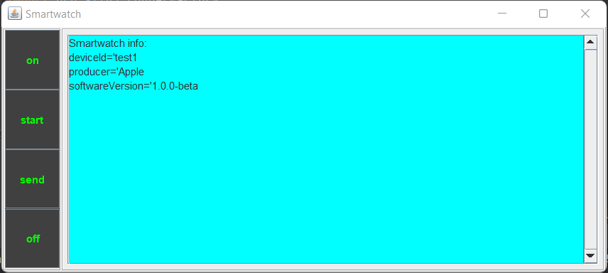
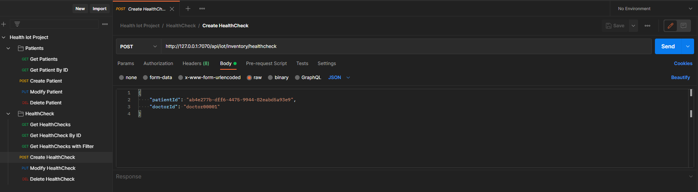

# IoT System
> The project aims to simulate a smartwatch in the role of publisher within the pub-sub paradigm using MQTT.
> The simple GUI allows to trigger all the functions of the core SmartWatch class, like connecting, measuring and publishing data.
> Fundamental is the presence and the coordination with an MQTT subscriber in order to make the application run properly.
> Moreover that subscriber exposes an HTTP REST API for interaction by a client with the resources hosted on the Data Manager and Collector (server), i.e. patient and healthcheck.
> Furthermore, the data manager and collector is able to manipulate and map the telemetry data received on the healthcheck, with the ability to detect anomalies on measurement data.
> The API is exposed through a configurable port (7070) and accessible locally at: http://127.0.0.1:7070/api/iot/inventory/

## Table of Contents
* [General Info](#general-information)
* [Technologies Used](#technologies-used)
* [Screenshots](#screenshots)
* [Setup](#setup)
* [Modeled REST Resources](#modeled-rest-resources)
* [Usage](#usage)
* [Project Status](#project-status)
* [Room for Improvement](#room-for-improvement)
* [Acknowledgements](#acknowledgements)
* [Contact](#contact)
<!-- * [License](#license) -->

## General Information
- The maven project contains all the software needed to simulate the scenario. 
- The project intends to provide a standard approach on how to manage, with a RESTful approach, resources on a server and map telemetry data to those resources.
- The project intends to provide a standard approach on how to synchronize the message flow between publisher and subscriber as well as showing how to use the MQTT's Paho framework in a simple way.
- The purpose of the project is to prototype a medical environment where a smartwatch is responsible for measuring the data from the patient and a doctor can register new patients and create related health checks, as well as obtain, modify and delete patient data and created health checks.

## Technologies Used
- Java - version 1.8
- Paho - version 1.2.1
- Gson - version 2.8.6
- Logback - version 1.0.13
- Dropwizard - version 1.3.9
- Jackson - version 2.9.8
- PostMan - version 9.13.0

## Screenshots

## Setup
Clone the repo from our GitHub
https://github.com/Superzano/OverallHealthIotProject.git and open it as a IntelliJ project.

## Modeled REST Resources
The IoT Inventory resources currently modeled are:

- Patient (/patient): A generic representation of a patient with basic information and customizable attributes.
- Healthcheck (/healthcheck): A generic representation of a medical test, associated with a patient, with basic information and customizable attributes.

## Usage
#### Simplest way
First run SmartWatchProcess (on the telemetry/process package), second run AppService (in the datamanager/services package), then start interacting with the resources through PostMan: you can manipulate the resources with CRUD interactions, thanks to the collection that I exported in the api package of this project
#### Fully potential 
Run SmartWatchProcessGUI (in the telemetry/process package), simultaneously run AppService (on datamanager/services package). Then keep caution about the following coordination step:

1. Press the button 'on' on the GUI.
2. Press the button 'start' on the GUI.
3. Make a post request from PostMan on your server.
4. Press the button 'send' on the GUI to measure.
5. At this point, from the GUI, you can either start a new cycle of measurements going back to the point 2. or press the button 'off' to disconnect the client and turn off the device.

## Project Status
Project is _complete_ for the exam's presentation.

## Room for Improvement

Room for improvement:
- Improve the GUI
- Improve the process of synchronization between publisher and subscriber
- support a local broker installed within the LAN
- Implement persistence with a database
- Implement a more complex anomaly detection through Machine Learning algorithms

## Acknowledgements

- This project was inspired by the ideas of both Christopher Zanoli and Jacopo Maragna.
- This project was based on Marco Picone's lectures (Ph.D. - picone.m@gmail.com).

## Contact
Created by Christopher Zanoli  (270765@studenti.unimore.it)  and Jacopo Maragna (271504@studenti.unimore.it)  - feel free to contact us!

